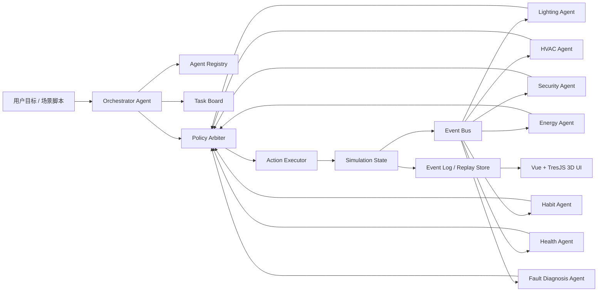
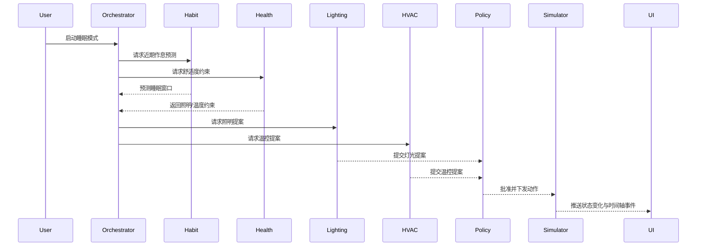
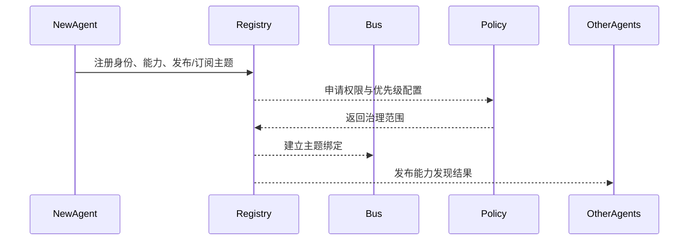

# 多智能体智能家居协同仿真系统架构设计文档

版本：v1.1
日期：2026-03-12
状态：评审修订稿（基于多智能体专家团队评审意见更新）

## 1. 文档目的

本文档用于定义“多智能体智能家居协同仿真系统”的正式架构方案。系统目标不是单纯实现若干设备控制界面，而是构建一套可扩展、可解释、可评测、可回放的多智能体协同仿真平台，用于验证智能家居中的任务分解、跨域协商、约束仲裁、异常恢复与用户个性化服务。

本文档同时将 `learn-claude-code` 项目中的运行时思想作为设计参考，但不会机械照搬其教学实现，而是将其中可迁移的核心机制升级为适用于智能家居仿真场景的生产级设计。

## 2. 背景与问题定义

当前仓库已具备以下基础能力：

- 基于 Vue 3 + Vite + TresJS/Three.js 的 3D 智能家居场景展示能力。
- 基于 GLB 模型的场景渲染、灯光状态变更与组件高亮能力。
- 一个适合作为“数字孪生展示层”的前端原型。

当前仓库尚不具备以下能力：

- 多智能体运行时。
- 智能体间标准化通信。
- 场景任务编排与依赖管理。
- 确定性的仿真真值层。
- 统一约束仲裁与安全治理。
- 长期记忆、状态压缩、事件回放与批量评测。

系统要解决的核心问题是：

1. 如何让多个智能体在智能家居领域中长期协作，而不是一次性对话式调用。
2. 如何在后续新增智能体时，避免对现有智能体产生大规模耦合修改。
3. 如何让智能体的“语言决策”与系统的“真实状态推进”解耦。
4. 如何让整个系统具备可解释、可审计、可回放和可评测的能力。

## 3. 设计目标

### 3.1 核心目标

- 构建统一的多智能体运行时底盘。
- 支持领域专家智能体的独立运行、相互通信与协作。
- 支持新智能体以注册方式接入，而不是以硬编码方式接线。
- 支持任务级、协议级和策略级的协调与仲裁。
- 支持确定性的智能家居仿真、状态推进与设备执行。
- 支持 3D 场景、事件时间轴和智能体决策链的可视化。
- 支持实验场景回放、批量评测和性能指标统计。

### 3.2 非目标

- 第一阶段不直接接入真实 IoT 硬件。
- 第一阶段不实现完整家庭自动化商品化平台。
- 第一阶段不把每个设备都建模成独立 LLM 智能体。
- 第一阶段不追求复杂社会行为模拟或多住户博弈。

## 4. 架构设计原则

### 4.1 统一循环，机制叠加

参考 `learn-claude-code` 中从 `s01` 到 `s12` 的演进，系统应遵循“统一 AgentCore + 机制叠加”的原则。Agent 的核心循环保持稳定，功能通过任务系统、协议层、消息层、压缩层与自治层逐步叠加。

### 4.2 对话不是系统真值

智能体对话上下文仅用于推理，不作为系统唯一状态来源。真正的系统状态必须放在对话外的持久结构中，包括：

- 仿真世界状态
- 任务板
- 事件日志
- 消息总线
- 会话快照
- 评测结果

### 4.3 语言决策与确定性执行解耦

LLM 智能体负责目标解释、任务分解、跨域协商、上下文推理与异常诊断。  
仿真内核负责时间推进、设备状态更新、规则执行和真值维护。

### 4.4 高内聚、低耦合

智能体不应通过硬编码互相认识全部队友。  
新增智能体应通过注册中心、事件订阅和统一协议接入协作网络。

### 4.5 风险前置治理

设备动作不应由任意智能体直接写入真值层。  
所有跨域动作必须经过策略仲裁与安全约束校验。

### 4.6 可观测性优先

系统必须从第一版开始记录：

- agent 输入输出
- 决策原因
- 协议往返
- 任务状态变化
- 仿真状态变化
- 设备执行结果
- 指标统计

## 5. 参考思想：对 `learn-claude-code` 的工程化提炼

| 课程 | 原始思想 | 在本系统中的工程化映射 |
| --- | --- | --- |
| `s01` | 最小 agent loop | 统一 `AgentCore` |
| `s02` | 工具扩展不改循环 | `ToolRegistry` |
| `s03` | 自我计划 | agent 局部 scratchpad |
| `s04` | 子智能体隔离上下文 | 一次性分析型 subagent |
| `s05` | Skill 按需加载 | 领域知识与策略库加载 |
| `s06` | 上下文压缩 | 长会话记忆管理 |
| `s07` | 持久任务板 | 家庭目标、故障工单、场景任务 |
| `s08` | 后台任务与结果注入 | 异步分析、批量仿真、历史挖掘 |
| `s09` | 持久队友 + 收件箱 | 长期存在的领域专家 agent |
| `s10` | request-response 协议 | 提案审批、撤销、升级、恢复 |
| `s11` | 空闲认领与自组织 | 事件驱动认领、自动唤醒 |
| `s12` | 控制面与执行面隔离 | 仿真 session 隔离、场景沙箱 |

## 6. 系统总体架构



## 7. 分层设计

### 7.1 展示层

职责：

- 展示 3D 房屋场景与设备状态。
- 展示智能体决策链、事件时间轴与审批面板。
- 提供场景运行、暂停、回放、单步执行等控制能力。

现有仓库角色：

- 当前前端可保留为数字孪生展示层的原型基础。
- 后续需要将前端中的设备逻辑逐步迁移至后端状态驱动模式。

### 7.2 API 与会话层

职责：

- 接收用户目标、场景脚本和调试命令。
- 创建、销毁和管理仿真 session。
- 提供 HTTP 接口和 WebSocket 实时事件流。
- 负责前端与控制平面的隔离。

建议技术：

- FastAPI
- WebSocket
- Pydantic schema

### 7.3 控制平面

职责：

- 任务分解
- agent 注册与发现
- 协议协调
- 任务板管理
- 策略仲裁
- 会话生命周期控制

控制平面组件：

- `Orchestrator`
- `AgentRegistry`
- `TaskBoard`
- `ProtocolManager`
- `PolicyArbiter`
- `SessionManager`
- `Scheduler`

### 7.4 智能体运行时层

职责：

- 统一执行各类智能体 loop
- 管理上下文、工具、技能、压缩与通知
- 提供消息适配与协议适配

运行时核心组件：

- `AgentCore`
- `ToolRegistry`
- `ContextManager`
- `SkillLoader`
- `MailboxAdapter`
- `BackgroundJobManager`

### 7.4.1 AgentCore 最小循环规范

每个 `AgentCore` 实例运行以下统一循环，各机制通过叠加方式接入，不改变核心结构：

```
loop:
  1. perceive()       # 从 Mailbox 拉取消息 + 从 EventBus 消费订阅事件
  2. inject_context() # 注入 WorldState 摘要 + 身份重注入 + 压缩后上下文
  3. think()          # 调用 LLM，携带工具列表 + 技能上下文
  4. act()            # 解析 LLM 输出，调用 ToolRegistry 执行工具 / 发送提案 / 发布消息
  5. observe()        # 收集执行结果，写入 EventLog（含 trace_id）
  6. compress_if_needed()  # 判断是否触发上下文压缩
  7. idle_claim()     # 空闲时轮询 TaskBoard 认领匹配任务
```

`ToolRegistry.call(tool_name, params)` 调用协议：

- 工具名称全局唯一，agent 只能调用已注册到自身的工具
- 调用结果以结构化 JSON 返回，包含 `success`、`result`、`error` 字段
- 工具调用失败后默认重试一次，超过后写入 `incident`

### 7.4.2 ContextManager 上下文压缩规范

压缩触发条件（满足任一即触发）：

- 上下文 token 数超过阈值（建议：模型上下文窗口的 60%）
- 单会话轮次超过 N 轮（建议 N=20，可配置）

压缩策略：

- 保留最近 K 轮完整对话（建议 K=5）
- 对历史部分执行摘要压缩（提取：已完成任务、当前目标、关键约束、活跃提案状态）
- 压缩前保存原始上下文摘要快照，写入 `EventLog`（类型：`context.compressed`）

身份重注入：压缩后必须在新上下文首部重新注入 agent 身份 prompt，格式：

```text
你是 {agent_id}，职责为 {role_description}。
当前会话 {session_id}，仿真时间 {sim_time}。
已知约束摘要：{constraint_summary}
当前活跃任务：{active_tasks}
```

### 7.5 仿真真值层

职责：

- 维护房屋、房间、设备、传感器和住户的真值状态
- 处理事件调度和设备动作执行
- 推进时间并产生状态变化

核心组件：

- `WorldState`
- `EventScheduler`
- `ActionExecutor`
- `ScenarioRunner`
- `ReplayEngine`

## 8. 智能体分类与职责定义

### 8.1 协调型智能体

#### `Orchestrator Agent`

职责：

- 接收用户目标或场景脚本。
- 将高层目标分解为跨域任务。
- 协调多个领域 agent。
- 将局部提案提交给协议层和策略仲裁层。

不负责：

- 不直接写设备状态。
- 不直接执行设备动作。

#### 分域 Orchestrator 设计（推荐）

为避免单一 `Orchestrator` 成为性能瓶颈与单点故障，推荐采用 **Global + Domain 双层 Orchestrator** 模式：

- `GlobalOrchestrator`：负责跨域目标分解、会话生命周期、跨域冲突上报
- `DomainOrchestrator`（每个域一个，如 `LightingOrchestrator`、`SecurityOrchestrator`）：负责域内任务分发、域内提案汇聚、向 `PolicyArbiter` 提交域内决策

降级策略：

- `GlobalOrchestrator` 故障时，各 `DomainOrchestrator` 切换为自治模式，只执行域内任务，暂停跨域协商
- `DomainOrchestrator` 故障时，域内任务由 `TaskBoard` 持有，等待恢复后重新认领

### 8.2 领域执行型智能体

#### `Lighting Agent`

- 照明策略、亮度、色温、联动方案。

#### `HVAC Agent`

- 温度、湿度、空气质量与舒适度控制。

#### `Security Agent`

- 门锁、安防、入侵、离家模式和夜间防护。

#### `Energy Agent`

- 能耗预算、峰谷调度、延迟执行和功率约束。

共同原则：

- 可以提出动作提案。
- 不可以绕过仲裁层直接写入真值层。

### 8.3 上下文推理型智能体

#### `Habit Agent`

职责：

- 分析用户作息、回家时段、场景偏好与行为规律。
- 输出习惯预测、偏好建议和时段约束。

#### `Health Agent`

职责：

- 分析舒适度阈值、睡眠条件、健康风险与环境限制。
- 输出健康约束、舒适度建议和风险告警。

#### `Fault Diagnosis Agent`

职责：

- 分析设备故障、传感器异常、执行失败与状态不一致。
- 输出诊断结论、恢复建议和降级策略。

共同原则：

- 发布“约束”和“建议”，而不是直接操控设备。

## 9. 新智能体接入机制

### 9.1 接入目标

系统必须支持后续新增智能体，例如：

- 用户行为习惯智能体
- 用户健康状态智能体
- 老人看护智能体
- 节假日场景智能体
- 家电维护智能体

新增智能体时，不应要求所有旧智能体逐个修改代码或 prompt。

### 9.2 接入方式

采用“注册制”，而非“接线制”。

每个智能体通过 manifest 注册：

```json
{
  "agent_id": "health_agent",
  "role": "context_reasoner",
  "capabilities": [
    "comfort_constraint_provider",
    "sleep_risk_assessor"
  ],
  "publishes": [
    "health.constraint.updated",
    "health.risk.alerted"
  ],
  "subscribes": [
    "sensor.sleep.changed",
    "scenario.sleep_mode.started"
  ],
  "request_handlers": [
    "assess_sleep_readiness"
  ],
  "proposal_scope": "advisory"
}
```

`proposal_scope` 枚举语义：

| 值 | 含义 |
| --- | --- |
| `binding` | 提案必须被执行，仲裁层只做合规校验 |
| `advisory` | 提案为建议，仲裁层参考但不阻塞决策，可被高优先级约束覆盖 |
| `optional` | 提案为可选优化，需用户确认或在系统空闲时执行 |

### 9.3 接入流程

1. 向 `AgentRegistry` 注册身份与能力。
2. 声明可订阅主题和可发布主题。
3. 声明支持的 request 类型。
4. 声明权限范围与动作范围。
5. 由策略层配置其优先级和约束地位。
6. 通过集成测试验证其对现有系统的影响。

## 10. 通信模型设计

### 10.1 通信原则

- 低风险状态同步使用事件发布订阅。
- 结构化协商使用 request-response。
- 设备动作使用 proposal-approval。
- 紧急异常使用 incident protocol。

### 10.2 统一消息模型

```json
{
  "message_id": "msg_0001",
  "correlation_id": "req_1001",
  "session_id": "sim_20260312_01",
  "kind": "event",
  "from": "habit_agent",
  "to": "lighting_agent",
  "topic": "habit.sleep_window.predicted",
  "payload": {},
  "timestamp": 1710000000,
  "ttl_ms": 5000,
  "require_ack": false
}
```

### 10.3 消息类型

- `event`
- `request`
- `response`
- `proposal`
- `decision`
- `incident`
- `heartbeat`

#### 心跳治理规范

agent 必须以固定间隔（建议 10s）向 `AgentRegistry` 发送心跳。`AgentRegistry` 按以下规则处理心跳异常：

| 状态 | 条件 | 处理动作 |
| --- | --- | --- |
| 警告 | 超过 2 个心跳周期未收到 | 标记 agent 为 `degraded`，发布 `agent.degraded` 事件 |
| 摘除 | 超过 5 个心跳周期未收到 | 标记 agent 为 `offline`，强制释放其持有的所有任务，触发任务板重新分配 |
| 恢复 | 再次收到心跳 | 标记为 `online`，发布 `agent.recovered` 事件 |

### 10.4 通信方式

| 模式 | 用途 | 是否必须经过 Orchestrator |
| --- | --- | --- |
| pub/sub | 状态广播、上下文建议、告警传播 | 否 |
| request/response | 协商、查询、分析请求 | 否 |
| proposal/approval | 动作提案与批准 | 是，经协议层与策略层 |
| incident | 异常升级、恢复流程 | 是 |
| heartbeat | 存活、负载与空闲状态 | 否 |

### 10.5 ConstraintContext 传递协议

上下文推理型 agent（Habit、Health）的输出必须以标准化 `ConstraintContext` 对象形式发布，而非自然语言描述。执行型 agent 提案时，由 `PolicyArbiter` 自动注入当前有效的约束集。

```json
{
  "constraint_id": "cst_001",
  "source_agent": "health_agent",
  "constraint_type": "range",
  "dimension": "lighting.brightness",
  "value": { "min": 0, "max": 30 },
  "priority": 3,
  "valid_until_sim_time": 1710003600,
  "reason": "睡眠模式：低亮度保护睡眠质量"
}
```

字段说明：

| 字段 | 说明 |
| --- | --- |
| `constraint_type` | `range`（值域）/ `forbidden`（禁止）/ `required`（强制）|
| `dimension` | 约束作用的设备属性路径，如 `hvac.temperature`、`lighting.brightness` |
| `priority` | 与策略仲裁层优先级对齐（1=安全，3=健康，5=能耗，7=体验）|
| `valid_until_sim_time` | 约束有效期（仿真时间戳），过期后自动失效 |

## 11. 协议与状态机设计

### 11.1 Request-Response 协议

适用于：

- 计划审批
- 专家咨询
- 风险评估
- 参数建议

状态机：

```text
pending -> acknowledged -> responded
pending -> timed_out
pending -> rejected
```

### 11.2 Proposal-Approval 协议

适用于：

- 灯光切换
- 空调设定
- 门锁操作
- 复合场景联动

状态机：

```text
drafted -> submitted -> approved -> executed -> confirmed
drafted -> submitted -> rejected
drafted -> submitted -> approved -> failed
```

### 11.3 Incident 协议

适用于：

- 设备故障
- 传感器异常
- 状态不一致
- 规则冲突

状态机：

```text
detected -> triaged -> assigned -> mitigated -> resolved
detected -> escalated
```

## 12. 策略仲裁层设计

### 12.1 作用

`PolicyArbiter` 是整个系统中最关键的治理组件，负责对智能体提出的动作进行最终裁决。

### 12.2 约束优先级

建议采用以下优先级：

1. 安全
2. 权限与隐私
3. 健康与舒适
4. 设备保护
5. 能耗预算
6. 用户偏好
7. 美观性与体验细节

### 12.3 仲裁输入

- 当前世界状态
- 目标场景
- 各 agent 提案
- 用户配置
- 规则集
- 风险级别

### 12.4 仲裁输出

- `approved`
- `rejected`
- `approved_with_modification`
- `deferred`
- `escalated`

## 13. 任务板设计

### 13.1 任务板作用

任务板是系统的控制平面核心之一，其设计直接继承 `s07` 和 `s11` 的思想，但升级为面向智能家居仿真的任务系统。

### 13.2 任务类型

- 场景任务
- 领域子任务
- 故障处理单
- 评测任务
- 分析任务

### 13.3 任务结构

```json
{
  "id": 12,
  "subject": "prepare_sleep_mode",
  "description": "协同卧室照明、温度、安防策略",
  "status": "pending",
  "owner": "orchestrator",
  "blockedBy": [10],
  "priority": "high",
  "session_id": "sim_20260312_01",
  "result_ref": null,
  "version": 1
}
```

`version` 字段用于乐观锁并发控制。

### 13.4 自组织认领

具备自治能力的 agent 可在空闲阶段认领：

- 与自己能力匹配的任务
- 未被阻塞的任务
- 权限允许的任务

**并发认领机制（CAS 乐观锁）**：

认领操作使用 Compare-And-Swap 语义：

```
claim_task(task_id, expected_version):
  if task.status == "pending" and task.version == expected_version:
    task.owner = agent_id
    task.status = "in_progress"
    task.version += 1
    return success
  else:
    return conflict  # agent 收到 conflict 后重新轮询任务板
```

多个 agent 同时认领同一任务时，只有第一个 CAS 成功者获得所有权，其余返回 `conflict` 并在下一轮重新轮询，消除竞态条件。

## 14. 仿真真值层设计

### 14.1 原则

- 仿真层必须独立于 agent 对话存在。
- 所有动作均以结构化命令作用于仿真层。
- 所有结果均以事件形式回流到控制平面和展示层。

### 14.2 核心实体

- `House`
- `Room`
- `Device`
- `Sensor`
- `Occupant`
- `Scenario`
- `Constraint`
- `ActionProposal`
- `PolicyDecision`
- `SimulationEvent`
- `StateSnapshot`
- `Incident`

### 14.3 时间模型

系统采用事件驱动的仿真时间模型：

- 支持仿真时钟
- 支持定时触发
- 支持设备动作延迟
- 支持失败与重试
- 支持暂停、恢复、单步与回放

### 14.4 设备动作执行

动作执行器只接收仲裁后的结构化命令，例如：

```json
{
  "action_id": "act_101",
  "device_id": "bedroom_light_1",
  "operation": "set_state",
  "params": {
    "power": "on",
    "brightness": 20,
    "color_temp": 2700
  }
}
```

## 15. 会话隔离与场景沙箱

### 15.1 设计目标

参考 `s12` 中“任务是控制平面，worktree 是执行平面”的思想，本系统需将：

- 场景任务协调
- 仿真会话执行

明确分离。

### 15.2 会话隔离对象

每个 `simulation session` 独立维护：

- 世界状态
- 事件日志
- agent 上下文
- 任务板视图
- 指标数据

### 15.3 作用

- 支持并行实验
- 支持 A/B 策略对比
- 支持故障注入测试
- 防止不同实验相互污染

## 16. 数据存储设计

### 16.1 第一阶段建议

- SQLite：元数据、任务板、会话索引、评测结果
- JSONL/Event Log：事件流、trace、回放记录
- 文件系统：技能、策略、场景脚本

### 16.2 后续可升级

- PostgreSQL：结构化状态与指标分析
- Redis：实时消息与会话缓存
- 对象存储：转录、回放快照、批量仿真结果

## 17. API 设计

### 17.1 HTTP 接口

- `POST /api/sessions`
- `GET /api/sessions/{id}`
- `POST /api/sessions/{id}/start`
- `POST /api/sessions/{id}/pause`
- `POST /api/sessions/{id}/step`
- `POST /api/sessions/{id}/scenarios`
- `GET /api/sessions/{id}/tasks`
- `GET /api/sessions/{id}/agents`
- `GET /api/sessions/{id}/events`
- `POST /api/sessions/{id}/approvals/{proposal_id}`

### 17.2 WebSocket 事件流

建议推送：

- `state.snapshot`
- `device.changed`
- `task.changed`
- `proposal.created`
- `proposal.decided`
- `incident.detected`
- `agent.message`
- `timeline.tick`

## 18. 前端集成设计

### 18.1 当前前端定位

当前前端作为”3D 展示层原型”继续保留。

**阶段一至四期间的前端策略**：

- 现有 TresJS/Three.js 原型**进入冻结状态**，不在此阶段继续开发
- 后端仅暴露一个**最小 WebSocket 存根接口**，推送 `state.snapshot` 事件，供前端验证连通性
- 避免前端逻辑迭代与后端架构迭代同时进行，防止长期分叉债务

正式前端集成在**阶段五**启动，届时后端 WebSocket 协议已稳定。

### 18.2 前端升级方向

新增模块建议：

- `simulationStore`
- `taskPanel`
- `agentTracePanel`
- `proposalReviewPanel`
- `timelinePanel`
- `replayController`

### 18.3 前端数据流

前端通过 WebSocket 订阅后端推送，不直接决定业务状态。  
前端所有交互均转化为：

- 用户目标
- 控制指令
- 场景脚本
- 审批动作

## 19. 典型场景时序

### 19.1 睡眠模式协同场景



### 19.2 新智能体接入场景



## 20. 可观测性与评测设计

### 20.1 必须记录的数据

- agent 输入与输出摘要
- 提案内容与决策结果
- 任务状态变化
- 协议往返链路
- 世界状态快照
- 执行动作回执
- 异常与恢复过程

### 20.2 Trace ID 贯穿设计

系统必须为每一条因果链维护贯穿的 `trace_id`，确保从 incident 可反向追溯至原始 LLM 输入。

```
用户目标 → trace_id 生成
  └─ Orchestrator 任务分解 → 继承 trace_id
       └─ LLM 推理调用 → 记录 (trace_id, session_id, agent_id, input_hash, output_summary)
            └─ 提案生成 → proposal 携带 trace_id
                 └─ PolicyArbiter 裁决 → 决策记录携带 trace_id
                      └─ ActionExecutor 执行 → 执行结果携带 trace_id
                           └─ WorldState 变更 → 快照记录携带 trace_id
```

所有可观测性数据的最小必含字段：

```json
{
  "trace_id": "tr_abc123",
  "correlation_id": "req_1001",
  "session_id": "sim_20260312_01",
  "agent_id": "lighting_agent",
  "sim_time": 1710000000,
  "event_type": "proposal.created",
  "payload": {}
}
```

`trace_id` 规则：跨 agent 传播时不变；新的用户目标触发时生成新 `trace_id`；子任务从父任务继承 `trace_id`。

### 20.3 核心评测指标

- 任务成功率
- 平均决策时延
- 平均执行时延
- 安全违规率
- 能耗总量
- 舒适度得分
- 冲突解决成功率
- 故障恢复时间
- 无效动作比例
- 单次场景推理成本

## 21. 风险与缓解策略

### 21.1 总控过载

风险：所有协作都依赖单一 Orchestrator，导致性能和复杂度失控。  
缓解：引入事件总线、注册中心和协议层，降低总控直接转发负担。

### 21.2 agent 耦合膨胀

风险：新增 agent 时所有旧 agent 都需修改。  
缓解：采用能力注册、主题订阅和统一协议。

### 21.3 对话上下文失控

风险：长时间运行后上下文爆炸，导致性能下降与身份丢失。  
缓解：引入压缩、状态外置和身份重注入。

### 21.4 语言输出不可控

风险：智能体自然语言输出不稳定。  
缓解：使用结构化消息与提案模型，关键动作必须经过仲裁层。

### 21.5 真值与展示不一致

风险：前端展示与后端状态分离失真。
缓解：前端只消费后端真值和事件流，不保留业务主状态。

### 21.6 WebSocket 背压失控

风险：`device.changed` / `timeline.tick` 等高频事件在大场景下积压，导致客户端阻塞。
缓解：服务端实现批量合并帧（同一 tick 内的多个设备变更合并为一条消息）；客户端设置消费节流窗口（建议 100ms）。

### 21.7 SQLite 写锁瓶颈

风险：多 Session 并发写任务板和评测结果时，SQLite 单写锁成为并发上限。
缓解：第一阶段启用 WAL（Write-Ahead Logging）模式；如并发 Session 超过 10 个，改为 Session 级分库（每个 session 独立 SQLite 文件）。

### 21.8 仿真时钟与推送时序不一致

风险：`EventScheduler` 的虚拟时间推进与 WebSocket 实时推送之间存在时序漂移，前端回放与真值不同步。
缓解：所有推送事件必须携带 `sim_time` 字段；前端以 `sim_time` 排序渲染，而非以接收时间排序；EventScheduler 推进时间后需同步屏障再推送事件。

### 21.9 LLM 响应延迟抖动破坏仿真一致性

风险：不同 agent 的 LLM 调用延迟差异导致仿真步骤串行积压，仿真时间被实际 API 延迟拉长。
缓解：仿真时钟与 wall clock 解耦，仿真时间仅在 `ActionExecutor` 确认执行后推进；为每次 LLM 调用设置超时（建议 30s），超时后触发降级提案（保持当前设备状态不变）。

### 21.10 PolicyArbiter 引入 LLM 导致安全层不可控

风险：若在仲裁层使用 LLM 进行约束评估，会导致"用 LLM 校验 LLM"的嵌套不确定性，安全约束可能被绕过。
缓解：仲裁层优先级 1-4（安全、权限与隐私、健康与舒适、设备保护）必须使用**确定性规则引擎**实现，完全不引入 LLM。优先级 5-7（能耗、用户偏好、体验细节）可考虑 LLM 辅助打分，但不能覆盖前四级规则的决策结果。

## 22. 分阶段实施建议

### MVP 阶段：最小可运行基线

> 目标：第一个可跑通的端到端验证版本，证明核心架构链路正确。

必须包含：

- `AgentCore`（最小循环：perceive → think → act → observe）
- `AgentRegistry`（注册 agent、查询 manifest、point-to-point 消息收发）
- `SessionManager`（创建/销毁独立仿真会话，隔离状态）
- `TaskBoard`（无依赖图版本：创建任务、认领、标记完成）
- 结构化事件日志 append-only（记录消息和状态变化，为回放打地基）

**MVP 验收标准**：让单个 agent（如 `LightingAgent`）走完完整链路：

```
接收事件 → LLM 推理 → 生成提案 → [占位仲裁] → ActionExecutor 执行 → 写入 EventLog
```

并输出含 `trace_id` 的完整 trace 记录。

暂缓至后续阶段（MVP 中不实现）：策略仲裁逻辑、任务依赖图、WebSocket 实时推送、回放播放器。

---

### 阶段一：运行时与控制平面基线

> 在 MVP 基础上，完善控制平面各组件。

目标：

- `ToolRegistry`（工具注册与 agent 级权限控制）
- `ProtocolManager`（request-response、proposal-approval 状态机）
- `PolicyArbiter`（确定性规则引擎，实现安全/权限/健康/设备保护四级约束）
- `ContextManager`（上下文压缩与身份重注入）
- WebSocket 实时推送（`state.snapshot`、`device.changed`、`task.changed`）

### 阶段二：仿真真值层

目标：

- 世界状态模型
- 事件调度器
- 动作执行器
- 回放日志

### 阶段三：首批领域 agent

目标：

- `Orchestrator`
- `Lighting`
- `HVAC`
- `Security`
- `Energy`

### 阶段四：上下文推理 agent

目标：

- `Habit`
- `Health`
- `FaultDiagnosis`

### 阶段五：前端控制台与 3D 联动

目标：

- 时间轴
- trace 面板
- 审批面板
- 3D 状态联动
- 回放控制

### 阶段六：评测与批量实验

目标：

- KPI 计算
- 场景基准测试
- A/B 对比
- 稳定性评测

## 23. 验收标准

### MVP 阶段验收标准

- 能创建独立仿真 session。
- 能注册并列出多个 agent（通过 manifest）。
- 单个 agent 能走通完整端到端链路（接收事件 → LLM 推理 → 占位仲裁 → 执行 → 写入日志）。
- 所有操作产生含 `trace_id` 的结构化事件日志。

### 阶段一验收标准

- 新 agent 能通过 manifest 接入，无需修改现有 agent。
- agent 间可通过统一消息模型通信（event、request、proposal 类型）。
- 任务板支持创建、依赖、认领（含 CAS 乐观锁）和完成。
- 提案必须经确定性规则仲裁后才能执行（安全/权限/健康/设备四级）。
- 仿真状态变化可实时推送给前端（含 `sim_time` 字段）。
- 事件与决策链可被完整记录，支持按 `trace_id` 查询回溯。

## 24. 结论

本系统的核心不在于“把多个模型拼在一起”，而在于构建一套可扩展的多智能体运行时与控制平面，并将其与智能家居仿真真值层解耦。

`learn-claude-code` 提供了非常有价值的运行时思想基础：

- 统一循环
- 工具式扩展
- 对话外状态
- 持久任务板
- 持久队友
- 协议化协调
- 自治认领
- 控制面与执行面分离

本方案将这些思想升级为适用于智能家居场景的正式架构。该架构既能支撑当前已有 3D 原型继续演进，也能支持后续新增习惯、健康、故障等智能体而不破坏整体系统结构。
